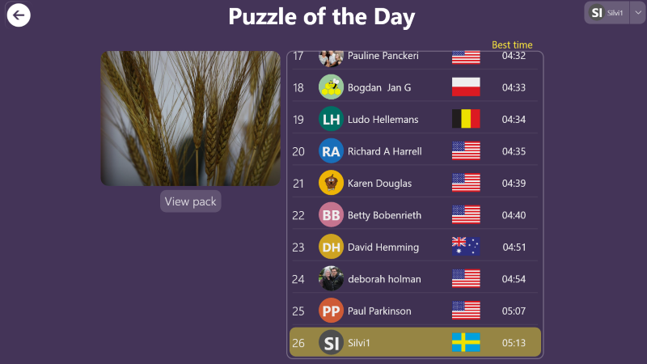

# How to See Your Rank in the Puzzle of the Day Leaderboard

Author: *Silvia*, last modified: _02/27/2021_

---

The Puzzle of the Day can be played in two modes: as a guest or as a registered player.

When you play as a guest, your time and rank won't be saved and shown to other players.

Creating an account will allow you to enter the Puzzle of the Day competition, and make your rank visible to others in the leaderboard. You will also earn coins when you finish Puzzle of the Day as a registered player.

Sign in with an account before starting to play the Puzzle of the Day if you want to see your rank and how you compare to others in the leaderboard.

## Sign in the Puzzle of the Day competition

Follow these steps to create an account:

1. Go to the Puzzle of the Day
1. Tap on **Sign in**
1. Choose **Create an account** if you are new to the game, or __Log In__ if you already have an account
1. After you signed in with you Microsoft Account, you will see your account page
1. Tap on the back arrow to go back to the Puzzle of the Day
1. Tap on the Puzzle of the Day to start playing

After you finish the puzzle, you will see your position in the leaderboard, and compare your time to other players' who solved the Puzzle of the Day.
The coins you earned will be added to your account automatically. You can check how many coins you have collected by going to your account page.

