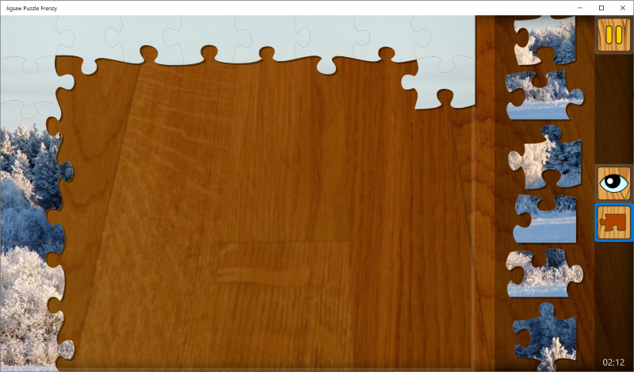

# What's New

Author: *Mihai*, last modified: _03/03/2022_

---

## 03.03.2022

* Jigsaw puzzle Tray board size increased from 85% to 100% of the screen

* BugFix: Fixed a crash when navigating to the play page before the results finished loading on the Puzzle of the Day page

## 01.03.2022

* Added new puzzle packs: Butterflies, Montana and Provence

* Added new Mahjong boards: Abundance, Alchemy, Ancient, Astral, Breathing, Channeling, Consciousness, Decoded, Divine, Dream, Energy, Geometry, Gratitude, Happiness, Healing, Hidden, Intention, Magic, Meditation, Mind, Mysteries, Origins, Potential, Realities, Relief, Sacred, Spiritual, Symbols, Universal, World

## 20.02.2022

* BugFix: Fixed several memory leaks

## 15.02.2022

* BugFix: Removed video background that was causing performance problems

## 10.02.2022

* Added *Most popular* and _Best price_ labels on subscription pages
* Added discount percentage to the yearly plan on the subscription plan
* Made the purchase with cash button on the product page the default button
* Added Remove ads card on pack page
* Added new user interface sounds
* BugFix: simplified several UI margins to be consistent across the games

## 31.01.2022

* Added more greetings
* Added new avatars

## 19.01.2022

* Added get new boards button to Mahjong
* Added play random to Mahjong
* Added featured product to Mahjong
* New Mahjong boards pack: Cosmos
* Reduced onboarding to 3 steps for puzzle games
* Added link to rewards article in the loyalty popup
* Added search support for packs, products, game pages and help articles

## 12.01.2022

* Added speed and completed puzzles statistics to the customize puzzle dialog
* Added completed indicator in customize puzzle dialog
* Random card is now dislayed even if the rate card is displayed
