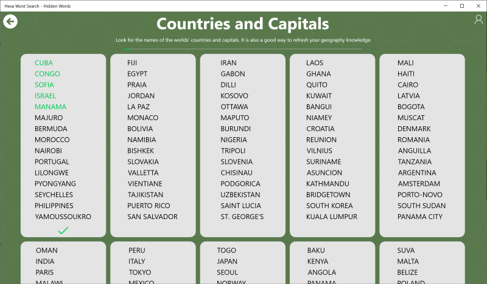
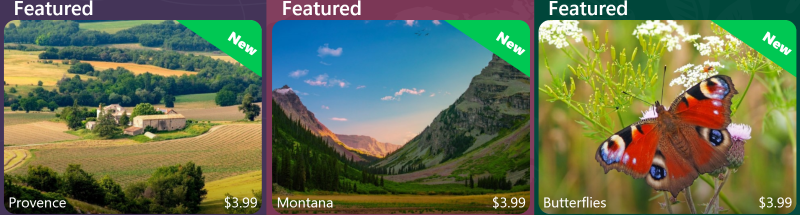
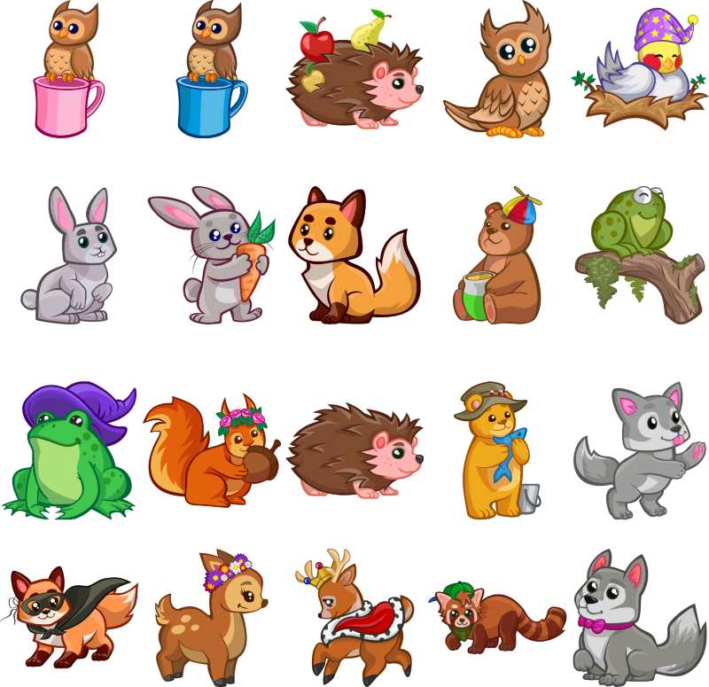

# Frenzy Games: News

Author: *Mihai*, last modified: _19.03.2023_

---

### Blossom

Spring is here and so is our new puzzle pack! 🌷

Introducing Blossom, a collection of 25 beautiful puzzles featuring stunning spring scenery and colorful flowers. From tulips and daffodils to cherry blossoms and magnolias, you’ll enjoy solving these puzzles and admiring the natural beauty of spring.

Blossom is available now for purchase in Jigsaw Puzzle Frenzy, the game that lets you explore the world by solving puzzles of landscapes, landmarks and architecture. Join a community of 30.000 players and solve a new puzzle every day.

Don’t miss this opportunity to brighten up your day with Blossom! 🌼

[Download Jigsaw Puzzle Frenzy from the Microsoft Store](https://www.microsoft.com/en-us/p/jigsaw-puzzle-frenzy/9wzdncrddqbm) and start your spring adventure!

### Rome

We are excited to announce that we have just released a new puzzle pack called Rome for our Jigsaw Puzzle Journey game. This pack will take you on a virtual tour of the Eternal City, where you can admire its stunning monuments, culture and cuisine.

Rome is one of our favorite destinations, and we wanted to share its beauty and charm with you through our puzzles. You will find 25 high-quality puzzles of Rome's attractions, such as the Colosseum, the Vatican City, the Pantheon and more. You can also customize your puzzles with different sizes, backgrounds and shapes to make them more fun and challenging.

Download Jigsaw Puzzle Journey today and start your journey.

Jigsaw Puzzle Journey is a fun and easy game that lets you discover the world solving puzzles. You can visit over 40 countries and explore their attractions, landscapes and food. You can also join our daily contest and earn crowns to unlock more puzzle packs.

Jigsaw Puzzle Journey is available on PC and it's free to play with optional in-app purchases. You can get it from the Microsoft Store here: [https://www.microsoft.com/en-us/p/jigsaw-puzzle-journey/9ndsmccmr7m9](ms-windows-store://pdp/?mode=mini&ProductId=9ndsmccmr7m9&cid=news)

Thank you for playing our game and supporting us. We hope you enjoy our new puzzle pack as much as we do. Please let us know what you think by leaving a comment below or contacting us at [puzzlefrenzyapp@gmail.com](mailto:puzzlefrenzyapp@gmail.com). Happy puzzling!

### Spring Blossom

A new puzzle pack Spring Blossom is available for [Jigsaw Puzzle Nature](https://www.microsoft.com/en-us/p/jigsaw-puzzle-nature/9p9xk4k4q2qk).

## 05.03.2023

The game settings have been moved to the bottom right of the play page.

## 02.11.2022

Now you can get the latest news about the game right on the Today page.

## 19.10.2022

New puzzle packs:

### Delicious Autumn

### London

### Autumn Animals

## 14.10.2022

Added Lucky Wheel. Spin the wheel to win rewards.

## 25.09.2022

Added Daily Gift. Open a gift every day and earn rewards.

## 17.09.2022

New puzzle pack: Cliffs

## 17.09.2022

New puzzle pack: Andalusia

## 17.09.2022

New puzzle pack: Cottages

## 17.09.2022

You can now see related puzzle packs to the bottom of the paid puzzle packs.

## 17.09.2022

You can now start a Premium trial straight from the today page and play the entire puzzle library for free.

## 17.09.2022

You can now Trade or Buy gems straight from a puzzle pack page when you do not have enough gems to skip the ads.

## 17.09.2022

You can now Trade or Buy crowns straight from a puzzle pack page when you do not have enough crowns to unlock the puzzles.

## 17.09.2022

You can now participate in the Puzzle of the Day competition using gems.

## 17.09.2022

The Account screen has been simplified.

## 17.09.2022

You can now get puzzle solving tools using gems.

## 16.09.2022

You can now skip ads using gems.

## 15.09.2022

Added a new screen called *Bank*.
You can use the Bank to trade and buy crowns or gems.

## 15.06.2022

* Added the number of downloads to the product page

## 12.06.2022

* Added **Top puzzles this week** section to the Store

## 06.06.2022

* Added explanations to **Subscription Plan** and __Trade__ sections
* The puzzle pack image is now set to the first image in the pack
* Fixed a UI glitch that was showing the progress and completed indicator briefly when the My Puzzles page was displayed
* Fixed a UI glitch that displays the incorrect puzzle frame position when starting a puzzle

## 05.06.2022

* Added new subscription plan section on Account page

* Added explanation for Trade section in Account page

* Added explanation for empty history statistics panel on Today page

* Added explanation for how "Play random puzzle" works

## 05.03.2022

BugFix: Fixed an occasional crash after watching an ad.  Read details [here](mahjong-zen-bugfix-march-5th-investigation.html)
New rounds layout and new board layout for Hexa Word Search

## 03.03.2022

* BugFix: Fixed a crash when navigating to the play page before the results finished loading on the Puzzle of the Day page.

## 01.03.2022

* Added new puzzle packs: Butterflies, Montana and Provence

* Added new Mahjong boards: Abundance, Alchemy, Ancient, Astral, Breathing, Channeling, Consciousness, Decoded, Divine, Dream, Energy, Geometry, Gratitude, Happiness, Healing, Hidden, Intention, Magic, Meditation, Mind, Mysteries, Origins, Potential, Realities, Relief, Sacred, Spiritual, Symbols, Universal, World

## 20.02.2022

* BugFix: Fixed several memory leaks

## 15.02.2022

* BugFix: Removed video background that was causing performance problems

## 10.02.2022

* Added *Most popular* and _Best price_ labels on subscription pages
* Added discount percentage to the yearly plan on the subscription plan
* Made the purchase with cash button on the product page the default button
* Added Remove ads card on pack page
* Added new user interface sounds
* BugFix: simplified several UI margins to be consistent across the games

## 31.01.2022

* Added more greetings
* Added new avatars

## 19.01.2022

* Added get new boards button to Mahjong
* Added play random to Mahjong
* Added featured product to Mahjong
* New Mahjong boards pack: Cosmos
* Reduced onboarding to 3 steps for puzzle games
* Added link to rewards article in the loyalty popup
* Added search support for packs, products, game pages and help articles

## 12.01.2022

* Added speed and completed puzzles statistics to the customize puzzle dialog
* Added completed indicator in customize puzzle dialog
* Random card is now dislayed even if the rate card is displayed
